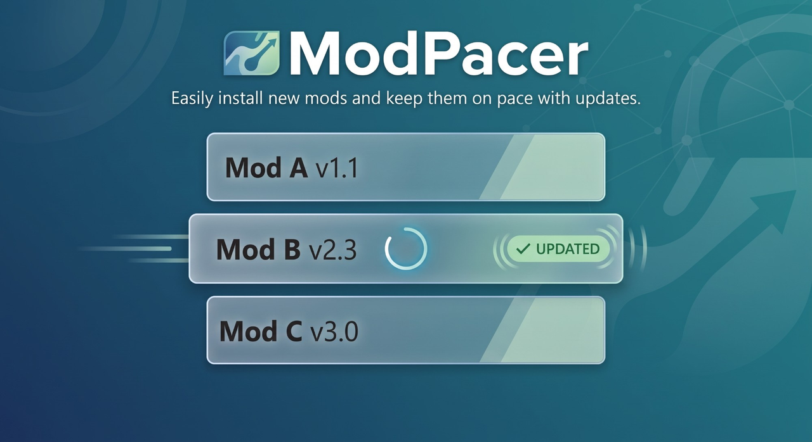

## What is ModPacer?

ModPacer is a free Windows tool that connects your mod manager to the [SkyrimNet Plugin Hub](https://fateless.ai/plugins). It runs in your system tray and opens in your web browser. It checks the SkyrimNet mods you have installed, shows which ones have a new version, and lists the Hub mods you do not have yet. One click installs or updates them for you.

It works with **Vortex** and **Mod Organizer 2**.

## Why use it?

SkyrimNet's plugins come from many different authors, and they do not notify you when they update. Without a tool you would have to visit each mod's page and compare versions by hand.

ModPacer does that for you. Open it, see at a glance what is out of date and what you are missing, and update or install it right there.

- **With Vortex:** It installs straight in and keeps each mod's place in your collections. Once the included Vortex Bridge is added, Vortex itself does a quick background check every time it starts. If any of your mods have updates, you get a notification inside Vortex. ModPacer does not need to be running for this, and you can turn it off in ModPacer's Settings.
- **With Mod Organizer 2:** It downloads the files into your downloads folder, ready for you to add. It never changes MO2 itself.

## 📋 What you need

- **Windows.**
- **[SkyrimNet](https://github.com/MinLL/SkyrimNet-GamePlugin)** installed.
- **Vortex** or **Mod Organizer 2**.

## 🚀 Getting started

1. **Run `ModPacer-Setup-1.0.0.exe`.** It installs just for you (no administrator needed) and tells you what to expect as it goes. *(Prefer no installer? The portable zip works too: unzip it anywhere you like.)*
2. **ModPacer opens in your browser** when the installer finishes. If it doesn't, double-click its small icon in your system tray down by your clock (or right-click it and choose **Open ModPacer**). You'll also find ModPacer in your Start Menu. *(With the portable zip, double-click `ModPacer.exe`, or run `start.bat`.)*
3. **Follow the guided setup.** A pop-up goes step-by-step to help you pick your mod manager and finds your Skyrim folder. If you choose Vortex, it points you to the Vortex Bridge that comes in the package and shows you how to add it to Vortex (drop its zip onto Vortex's Extensions page).
4. **Let it check.** Once setup is done, ModPacer looks for new versions right away.

Stuck on anything? Check the **Help** tab inside ModPacer.

## 🤝 Credits

Built with ideas and code from [Vortex](https://github.com/Nexus-Mods/Vortex) and [fomod-installer](https://github.com/Nexus-Mods/fomod-installer) (Nexus Mods), 7-Zip by Igor Pavlov, the [SkyrimNet Plugin Hub](https://github.com/MinLL/SkyrimNet-Plugins), fateless.ai (the icon and the Plugin Hub API), [Vortex Collection Tools](https://github.com/awesmdiver/vortex-collection-tools) (how ModPacer updates and removes mods in Vortex), and the Vortex Bridge.

## 📄 License

[GPL-3.0](LICENSE). Free to use, change and share under the same terms.

## 💬 Need help?

Start with the **Help** tab inside ModPacer. Found a bug, or have an idea? Open an issue on the [Issues page](https://github.com/awesmdiver/modpacer/issues): there is a short form for each.

## 🧰 More from the author

ModPacer is one of a small set of free tools for a smoother modded Skyrim. See them all on the [tools page](https://awesmdiver.github.io/).
